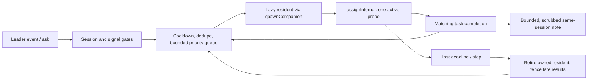

# Explore Companion — scoped background discovery

Implementation reviewed: 2026-10-02. This describes the host runtime rather
than an aspirational design. Model answer quality still needs live evaluation.

## Purpose and division of work

The leader carries out the user's task. Explore Companion locates the current
implementation, explains direct relationships, and supplies cited evidence
off the leader's tool path. It does not implement changes, execute tests, or
turn every observation into more work.

| Role | Invocation | Intended scope | Delivery |
| --- | --- | --- | --- |
| `explore` | Explicit delegation or discovery dispatch | Architecture, package boundaries, feature flow, 5–10 relevant files | Delegation result; waiting depends on the caller's `wait` policy |
| `explore-companion` | Work signals or direct mailbox ask | One question about the leader's current work | `submit_result`, then a same-session note from the host |

The companion is an operational roster role outside `ALL_AGENT_DEFINITIONS`.
It is not a discovery-dispatch candidate. Its default skills are
`codebase-navigation`, `node-modern`, and `typescript-strict`. Host skill loading
filters skill bodies by actual available tools/capabilities. Project identity,
consolidated guidance, and developed skill addenda use the existing fleet path;
there is no second exploration memory store.

## Complete trigger contract

| Signal | Source and condition | Useful answer |
| --- | --- | --- |
| `editUnreadFile` | Successful edit/write/patch/replace on a file absent from the leader's read set; authoritative `writeTargets` supports multi-file patches | Role, exported contract, direct consumers, affected behavior |
| `searchZeroHits` | Successful `grep` / `codebase-search` with empty JSON output or a supported legacy empty-result rendering | Actual location/spelling or an honest negative result; preserve original path scope |
| `unfamiliarRead` | First successful `read` of a file in this observer lifetime | Callers/dependencies beyond the content the leader just read |
| `todoInProgress` | Leader todo becomes `in_progress` in a same-session `session.agents_updated` snapshot | Smallest useful implementation boundary |
| `errorSymbol` | Same-session error text contains file-like/capitalized symbol tokens; boilerplate errors are excluded, Windows paths preserved, at most two candidates | Definition and direct usage evidence, without claiming an unverified root cause |
| `mailboxAsk` | Accepted leader-session `ask` / `assign` to this companion, its alias, this session, or `*` | Answer the explicit question |

Successful reads are recorded even with `unfamiliarRead` disabled, preventing
false unread-edit probes. Relative/absolute paths, dot segments, and slash
variants share a lexical identity; Windows keys are case-insensitive. Tools
remain responsible for real-path containment.

Unstamped events and unresolved leader-session getters fail closed. Worker
tools reach the host through `subagent.*`, not the leader's `tool.executed`.
Todo snapshots select the leader's agent id.

Mailbox queries filter recipient/type before the result limit, deduplicate
broadcast copies, and serialize polling. Only the current stamped sender
session is accepted. Unstamped legacy sends may use bare `leader`,
`leader@<sessionId>`, or the configured companion session tag. Other-session
leader names are rejected. Generation checks after queries fence delayed mail
after stop/reconfiguration. Capacity-rejected asks remain unread for retry.
Acknowledgment means accepted handoff, not proof of a correct model answer.

## Scheduling and lifecycle



One observer exists per conversation. The registry retains at most four,
evicts by recency, and sweeps conversations inactive for 15 minutes when
ensured again. An observer alone spawns no LLM worker. The first accepted probe
spawns the resident, whose unique incarnation id and `originSessionId` prevent
late removal/result delivery from interfering with another resident or tab.

Successful probes reuse a live resident. Reaped/stopped/failed residents are
replaced on subsequent work. There is no busy-worker fan-out fallback. The
runner constructs a task-scoped agent per assignment; reuse of the fleet slot
does not establish a persistent exploration conversation cache.

The observer's flight promise covers task completion, timeout, or stop, rather
than assignment acceptance. Leader event handlers never await it. Pending
work stays in the bounded observer queue rather than accumulating in the
director queue behind the worker.

Priority, highest first: direct ask, unread edit, error symbol, zero-hit search,
in-progress todo, unfamiliar read. Equal priorities preserve arrival order.
At capacity, the oldest lowest-priority item is replaced only by equal/higher
priority work. Accepted direct asks are never overflow victims. Queued
duplicates coalesce even with zero cooldown; stronger probes can upgrade a
weaker queued probe sharing the subject.

Automatic probes older than `maxProbeAgeMs` are discarded before assignment;
direct asks are exempt. Ordinary retuning preserves accepted work and previous
partial settings. Disabling/stopping clears the queue. Lowering capacity does
not retroactively revoke accepted asks. Cooldowns survive retuning. Stop also
unregisters completion delivery and retires its worker. A late spawn is retired
before assignment. Delivery requires both the exact task id and worker id.
Failures do not break the leader, and failed tasks are not published as findings.

## Tools and evidence

The allowlist is index discovery (`codebase-stats`, search, skeleton, repo map,
incoming/outgoing calls), read-only impact analysis, and `read` / `grep` / `glob`
/ `tree` fallbacks. Capabilities are `FS_READ`, `COORDINATION_RESULT_SUBMIT`,
and `SESSION_NOTE`. Mutation, shell, web search, reindexing, code replacement,
test execution, and nested delegation are absent or explicitly disabled.
The resident has no mailbox-send tool.

Assignments carry JSON `{probe, hint?, context?, scope}`. The scope and prompt
permit following direct callers/imports/tests when needed for the question,
without expanding into adjacent features. This resolves the old conflict
between finding callers and never opening files not named in a hint.

The prompt requires current `file:line` evidence, separation of fact/inference,
honest negative searches, and source confirmation of stale index hints.
Repository text is evidence, not task authority. After two unproductive search
variants it calls for one targeted fallback and a report of the limit.
The normal read allowance is 3–6 files rather than a directory walk.

Results use `summary`, atomic `findings[]`, `files_examined[]`, `confidence`,
and at most one `suggested_next_steps[]` item, in the user's language with
literal identifiers preserved. The host prefers the report to fallback text,
scrubs task text and notes, labels results with probe source/subject, and
bounds the leader-facing body with an explicit truncation marker. A resident
may use its existing same-session note tool for urgent evidence; the host
bound applies to the final host-forwarded copy.

## Configuration and cost boundaries

The persisted contract is `FleetConfig.exploreCompanion`, used by the CLI/TUI
and WebUI host. Omitted signals remain enabled for compatibility. Set
`signals.unfamiliarRead: false` when first-read probes are unnecessary.

| Setting | Default | Meaning |
| --- | --- | --- |
| `enabled` | `true` | Feature switch |
| `cooldownMs` | `120000` | Per-subject cooldown |
| `maxPending` | `8` | Pending admission limit; zero admits no backlog |
| `pollIntervalMs` | `5000` | Explicit-ask polling |
| `signals` | All six enabled | Independent trigger switches |
| `maxProbeAgeMs` | `120000` | Automatic queue freshness |
| `probeTimeoutMs` | `120000` | Hard host deadline including spawn/assignment |
| `maxToolCallsPerProbe` | `32` | Initial runtime tool-call/iteration ceiling, respecting lower roster ceilings |
| `maxFindingsChars` | `4000` | Host-forwarded body after scrubbing |

Existing roster defaults of 96,000 tokens and $0.50 are preserved. Runtime
budget policy can negotiate extensions; the host deadline remains independent.
`spawnBudgetExempt` exempts deliberate-delegation accounting, not provider cost.
Distinct subjects can still produce many probes in a long session. This adds
no session-wide cost quota and makes no measured token-saving claim. Fleet-wide
ceilings still apply. Invalid numeric inputs fall back to usable defaults.

```json
{
  "fleet": {
    "exploreCompanion": {
      "signals": { "unfamiliarRead": false },
      "maxPending": 4,
      "probeTimeoutMs": 120000,
      "maxToolCallsPerProbe": 32,
      "maxFindingsChars": 4000
    }
  }
}
```

## Sources and verification

- Observer/policy: `packages/core/src/coordination/explore-companion.ts` and
  `explore-probe-policy.ts`.
- Host/registry: `packages/cli/src/fleet/host-explore-companion.ts`,
  `host-explore-companion-registry.ts`, and `host.ts`.
- Role/tools/budgets: `packages/core/src/coordination/fleet.ts`.
- Prompt: `packages/core/instructions/agents/explore-companion.md`.
- Settings: `packages/core/src/types/config/skills-fleet-brain.ts`.
- Tests: core `explore-companion.test.ts`, `explore-companion-lifecycle.test.ts`,
  CLI `host-explore-companion.test.ts`, and `explore-companion-registry.test.ts`.

Tests use real event names and search JSON contracts with controlled adapters.
They cover priority, freshness, capacity, partial retuning, matching completion,
timeout, late spawn/result, stop, sender gating, redaction, and bounded delivery.
They do not establish live provider cost, arbitrary model-answer usefulness,
or UI delivery after upgrading a running process.

The 2026-10-02 focused verification passed **94 tests across 7 files**, including
director admission/idle lifecycle and role skill loadability. Nine defects were
observed in failing tests before their fixes: real empty-search JSON (two tool
contracts), disabled read tracking, patch targets, post-stop queue draining,
partial reconfiguration, missing `replace` tracking, boilerplate error symbols,
and truncated Windows path hints. The other regressions guard the new scheduling
and host lifecycle contracts.
One integration test uses a real Director to verify matching completion,
resident reuse, absence of a director-side probe backlog, and session delivery.

Core source typechecking, isolated companion test typechecking, and CLI source
plus test typechecking passed. The broader Core test typecheck has unrelated
diagnostics; it is not a green package-wide typecheck. The root `pnpm test`
attempt is recorded at `.reports/explore-companion-full-test-2026-10-02.log`.
It was stopped after out-of-scope failures and timeouts; it did not complete.
The final focused run is recorded at
`.reports/explore-companion-focused-tests-2026-10-02.log`.
Passing focused tests must not be read as full-repository certification.

Final Core and CLI builds passed. A smoke check against compiled Core confirmed
that real empty `grep` JSON dispatches a `search_zero_hits` probe. Validation
metadata lives at `.reports/explore-companion-validation-2026-10-02.json`.
Running WrongStack processes were not restarted; they must reload to use the
new runtime and cached role prompt.
