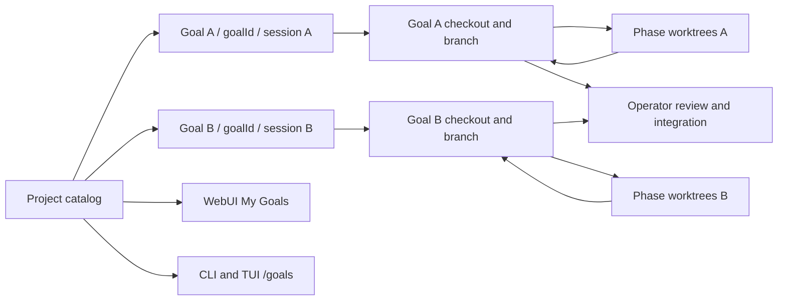

# Project goals and My Goals

The executable Goal workflow now uses its existing `PhaseGraph.id` as its stable
goal id. The canonical project `autophase` store holds every goal, including a
planning record before executable phases exist. A terminal owns its current run;
the project catalog exposes all runs to CLI/TUI and WebUI.

## Ownership and parallel execution

New git-backed goals receive a dedicated managed checkout and branch. Phase
worktrees fork from, and integrate into, that goal's checkout. A second terminal
can execute another goal without changing the first goal's checkout or the
project's primary branch. The goal checkout is retained for operator review and
integration. This intentionally changes the automatic integration destination
for new goals: the goal branch, rather than the project branch.

Isolated goals use a goal-specific, process-backed lease. Resuming the same goal
in two hosts is refused. Legacy graphs and runs explicitly using the shared
project checkout retain the project-wide lease. Saved workspace identity is
validated by `WorktreeManager.adopt`; a lost checkout is an error, not permission
to run in a different directory.

One WebUI server admits up to eight live goal handlers and retains up to 64
loaded handlers. Dormant handlers and socket listeners are disposed when evicted.
This is a server limit; it is not a shared project spending budget.

## Catalog and controls

`/goals` lists the project catalog. `/goals <id>` and `/goal status <id>` show
one goal's session, owner, phases, task counts, blockers, verification and branch.
WebUI's My Goals searches by title/id and filters to the current session. Selecting
another goal does not stop the previous goal. New goal resets only the local form.
Run/control frames and phase events carry the goal id; phase events also retain
their owning session id.

The WebUI can observe goals owned by another terminal. Those snapshots are read
only; stop/retry/mutation commands must be sent in the owning terminal. Cross-host
remote control needs a separate authenticated control transport and is not
implemented by editing another host's saved graph.

## Progress and reachability

My Goals uses completed tasks divided by total tasks for work progress. A goal
with no tasks displays `—`. Phase counts and phase status are separate fields.
Task completion alone does not establish that the target has been reached.

Reachability is `blocked` when failure/integration blockers exist, `verified` only
when terminal phase/task evidence and an executed final verification agree,
and `unknown` otherwise. Skipped verification is retained as skipped and cataloged
as `not_run`; it must not become a verified result. This does not predict future
success probability, cost, or delivery date.

## Lifecycle protections and evidence

- Pause stops admitting new tasks in the same phase, while active tasks can finish.
- Stop fences late phase/final verification results.
- A stop during final verification can resume only that gate without replaying
  completed tasks; unmerged phases must be reviewed first.
- Setup and execution settle before the host releases its lease.
- Refused phase integration fails the phase/goal instead of announcing completion.
- Task ownership is retained independently of timeout grace: an old worker cannot
  overlap a retry of the same task, and checkout slots remain occupied until the
  worker settles. Orchestrator restart is refused while workers remain owned.

Executable before/after proofs and the audit ledger are under
`.temp_files/goal-system-20261005/` and `.temp_files/ledger_goal-system-controls.md`.
Permanent lifecycle, catalog and real Git integration tests are beside Core,
CLI and WebUI-server source. Browser-component tests cover My Goals selection,
session filtering and isolation of incoming goal events.

## Compatibility boundary

The persistent eternal/parallel mission (`goal.json`, `/goal set`, `/goal refine`)
remains a separate legacy aggregate. This change makes executable phase goals
multi-owner; it does not silently migrate the eternal engine's singleton mission
into multiple simultaneously driven missions. That migration must bind each
engine iteration to a mission id and session, and protect journal/completion writes
under the same binding before it can share this catalog safely.

Project-wide maintenance and isolated-goal admission share one short file lock.
Maintenance refuses while any goal has a live/unknown owner, and new isolated
goals refuse while the project maintenance lease is held. The lock spans the
ownership check and exclusive lease creation, preventing a start during cleanup.
Phase/worktree events use the goal's captured session rather than whichever tab
happens to be in front when an asynchronous event arrives.
