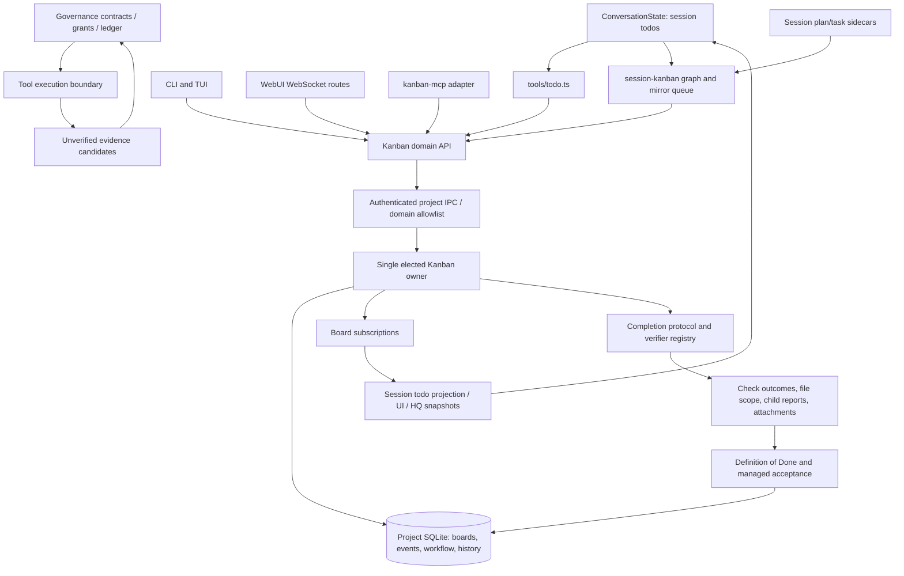

# Kanban, session work and evidence architecture

Date: 2026-10-02. Scope: Kanban domain/storage, session todos/plan/tasks,
completion and verification, governance, dispatch, CLI/TUI/WebUI/HQ/MCP.
This is a source-grounded architecture and repair ledger, not a zero-defect certificate.
The checkout contained existing concurrent changes when this review began.
Continuation completed on 2026-10-03 (Europe/Kiev); proof filenames retain the starting audit date.

## 1. Ownership and data flow



| Entity | Authority | Identity and lifetime |
| --- | --- | --- |
| Tactical todo | `ConversationState.replaceTodos` | Session-local `TodoItem.id`; checkpoint persists across resume |
| Bound managed todo | Accepted Kanban card state | `kanbanBoardId` + `kanbanTaskId`; an attempted todo edit is a request |
| Session plan | Session plan sidecar via `mutatePlan` | `plan:<session>` + source item id |
| Session task | Session task sidecar via `mutateTasks` | `session:<session>` + source task id |
| Session mirror card | Project Kanban owner, reflecting the source | `origin.system`, `origin.graphId`, `origin.taskId` |
| Independent managed card | Project Kanban owner | Board id + task id; lifecycle and acceptance own completion |
| Assignment | Owner's claim/lease state | Agent, attempt, lease id, heartbeat, expiration |
| Verification | Outcome of an executed check against a particular input/workspace | Task/board, criteria, attempt/lease, baseline, report |
| Governance evidence candidate | Observation ledger | Tool call + task + plan fingerprint + workspace manifest; initially unverified |
| Governance verified evidence | Verification issuance and ledger | Bound check/run and workspace identity; candidates alone do not admit completion |
| UI selection | Surface-local state | Active project/session/board/task; delayed replies must respect current selection |

There is no universal rule that "the board is always the authority". Unbound
todos and plan/task sidecars own their source data. A **managed binding** changes
status authority to the card. A **session mirror** reflects its source. Confusing
these directions creates circular updates and false completion.

## 2. Source map

| Layer | Main source paths | Responsibility |
| --- | --- | --- |
| Todo state | `packages/core/src/core/conversation-state.ts`, `storage/todos-checkpoint.ts`, `utils/todos-format.ts` | Mutation/events, all-completed snapshot, checkpoint and model rendering |
| Todo requests | `packages/tools/src/todo.ts` | Identity preservation, binding, missing cards, dependency demotion, managed advancement and source rollup |
| Session mirror | `packages/tools/src/session-kanban.ts`, `session-kanban-graph.ts`, `session-kanban-sync.ts` | Per-source coalescing/serialization, origins, subscriptions, reverse projection |
| Domain | `packages/kanban/src/manager/`, `types.ts`, `types-operations.ts` | Boards, tasks, details, graph, dependencies, decomposition, queues and assignment |
| Owner/storage | `packages/kanban/src/server/project-server.ts`, `sqlite-storage.ts`, `storage.ts` | Election, SQLite persistence, revision checks and subscriptions |
| IPC | `packages/kanban/src/client-domain.ts`, `domain-operations.ts`, `server/client.ts`, `server/protocol.ts` | Authenticated typed domain calls; production has no direct-file fallback |
| Managed lifecycle | `packages/kanban/src/manager/lifecycle/` | Adjacent stage transitions, details, ownership, WIP, review and acceptance |
| Verification | `packages/kanban/src/verification/` | Registry, command policy, workspace snapshot, evidence validation, reports, completion gate and refusal budgets |
| Governance | `packages/governance/src/` | Task contract, plan versions, grants, workflow, verification issuance, evidence ledger and workspace fence |
| Agent tools/MCP | `packages/tools/src/kanban*.ts`, `packages/kanban-mcp/src/adapter.ts` | Domain actions, input contracts and transport adaptation |
| Host execution | `packages/cli/src/execution-kanban-dispatch.ts`, `packages/webui-server/src/server/kanban-dispatch.ts`, `kanban-supervisor.ts` | Worker execution and results/lease propagation |
| Web server | `packages/webui-server/src/server/kanban-*-routes.ts`, `kanban-daemon-subscriber.ts` | Session-scoped WebSocket operations and broadcast |
| Web client | `packages/webui/src/stores/kanban-store.ts`, `components/Kanban*.tsx`, `TaskVerificationSection.tsx`, `VerificationReportPanel.tsx` | Board/workbench/tree/details/checks/verification and pending operations |
| Terminal | `packages/cli/src/slash-commands/kanban*.ts`, `todos.ts`, `packages/tui/src/components/kanban-panel*.tsx`, `todos-monitor.tsx` | Commands and terminal projections |
| HQ | `packages/cli/src/kanban-hq-sync.ts`, `packages/webui-hq/src/domain/kanban-*.ts`, `views/` | Cross-project snapshots and task actions |

## 3. State and completion contracts

Managed cards follow `Backlog -> Todo -> Running -> Review -> Done`. Moving
forward requires task details and explicit criteria. Running requires ownership
and satisfied dependencies; Review requires worker output. Done requires
acceptance evidence, completed children and a truthful reviewer action. Done is
terminal; new work uses a follow-up card. `autoAccept: false` holds work in Review.
Accepted managed work also protects its task definition and criterion outcomes
from detail edits, dedicated criterion operations, dependency addition and split.
Notes/labels and unchanged criteria remain editable. Replacing accepted evidence
must satisfy the same Definition of Done; the external report API cannot write a
new failed/incomplete report over accepted work. Legacy source-owned cards retain
their editable contract. Dedicated criterion operations live in
`manager/task-checks.ts`; `manager/tasks.ts` re-exports the established API.

Legacy completion uses `finalizeTaskCompletion`: verify outside the storage
mutation, then apply report/check results/final state in one mutation. Strict
refuses a failed gate; soft records a warning and may complete; off explicitly
skips verification. Managed boards cannot turn the gate off. Run/session mirrors
retain their own source completion contract.

Tactical todo has only `pending`, `in_progress`, `completed`. A managed card in
Review must project as open work, even when its worker assignment is completed.
Only accepted `task.status === completed` means a completed managed todo.
Repeated todo requests must not re-dispatch work already awaiting acceptance.

`replaceTodos` collapses an all-completed list to `[]` and emits
`completedSnapshot`. The mirror must preserve this final snapshot; projections
must compare both the full projection and its collapsed form to avoid repeated
notifications. Omission does not cancel unfinished model-owned rows. Explicit
human remove/clear is a distinct operation.

## 4. Task details and relationship invariants

- IDs, not titles, identify cards and source items. Title matching is a fallback
  when no durable binding exists; never overwrite a foreign board binding.
- `dependsOn` describes execution prerequisites. Parent/child describes
  aggregation. Chain describes order. Contract graph describes requirements,
  implementation, verification and evidence. None substitutes for another.
- Missing dependencies fail readiness. Missing children fail parent acceptance;
  a missing child must not disappear from a filtered lookup.
- Stored dependency/child IDs resolve exactly. Unique prefixes are only a caller
  convenience for selecting the task being operated on; they cannot turn a missing
  relation into an unrelated successor. Missing task readiness returns false.
- Graph create/sync rejects cycles in the union of `parentId` and `children` before
  writing. Partial imports can still intentionally omit nodes outside their slice.
- A composite parent is not a leaf dispatch target. Todo projection includes
  executable leaves; invisible parent completion is a separate rollup.
- Description, criteria input (`notes`), expected file changes and boundary
  define work. Check status and narrative output are different data.
- Editing a check's executable input invalidates its previous pass/fail status
  and report. A verification result must never overwrite the newer definition.
- Split/merge create new work: inherited criteria are pending and inherited
  assignment carries only routing/configuration. Claims, attempts, worker output,
  execution IDs and baselines are not inherited. Default derived work leaves a
  predecessor's Running/Review/terminal stage; explicit legacy column selection
  remains supported. Managed derivation always starts at Backlog.

## 5. Verification and evidence invariants

The registry executes deterministic check plugins, or explicitly configured
agent/council escalation. Escalation passes require concrete backing evidence.
Manual checks carry explicit reviewer status. Report attachment is not acceptance.

File scope compares the declared file **and operation** with the diff from the
provided baseline. A child's file scope must be verified when verifying its
parent. Child verification uses the same full protocol as standalone verification
and prefers that child's assignment baseline, falling back to an explicitly
provided baseline. Running assignments with `expectedFileChanges` or `git_diff`
criteria capture `verificationBaseline` before work starts. Snapshot capture is
outside the mutation and its publication is guarded by the captured board revision.
Older tasks without such a baseline cannot retroactively prove pre-work file scope.

Verification spans awaits and can race with edits, archive, lease recovery or
deletion. Capture the input/ownership fingerprint before executing checks and
compare it again before returning evidence, persisting it, and finalizing the
gate. This fence covers task state/results, assignment ownership/baseline,
reachable children/dependencies and acceptance policies. Presence, heartbeat and
lease-expiry renewal, notes/links/labels/order/due dates, and unrelated tasks do
not invalidate the work. Publishing merges only verifier-owned fields into the
current task, retaining concurrent liveness and metadata writes. A changed
criterion/status/report, lease/attempt, descendant or policy rejects the old
result. Commands are not silently re-executed. Board revision remains the storage
CAS and evidence provenance counter, rather than the long-running verifier's
acceptance fence.

Definition of Done must reject a failed/error/incomplete report for every task,
not just composite tasks. A report belonging to another task/board/lease/attempt
must not settle the current card. Criterion edits must not reuse old coverage.
New reports carry an SHA-256 `inputFingerprint` over task and executable criterion
inputs (including `notes` and escalation, excluding outcome statuses). Detail
editing resets changed assertions and invalidates their report. Older reports
without the optional fingerprint retain compatibility; external run evidence on
explicitly ungated mirror boards remains owned by the run engine.

Skipped checks produce `needs_human`, never `passed`. Without an available verifier,
only manual/review checks can pass through an explicit approval status. Agent,
council and automatic check flags cannot manufacture verified evidence. System One
re-runs previous automated verdicts against current evidence; a human-set status
does not trigger a new automated judgment.
Done additionally requires matching passed report entries for executable or escalated
criteria, and an actual file-scope report for declared file expectations. A status
flag on a command/test/agent check cannot substitute for its execution.

Parent reports carry a `subtaskInputFingerprint` over reachable descendant contracts,
accepted statuses, criterion outcomes, leases/attempts, baseline and stored verdict.
Changed descendants require fresh parent verification; unrelated board metadata does
not invalidate stored evidence. This closure is traversed iteratively and cycle guarded.
Validation of such a parent report requires the current board, not just a task object.

Goal/SDD run-mirror writes are serialized per engine/run while independent runs
can proceed separately. Its deduplication stamp contains the projected graph,
assignment and phase/wave structure, not merely status/model. A stamp is committed
only after successful sync and publication; the next identical snapshot can retry
a failed projection. SDD report comparison includes command, evidence, attempt and
engine completion time so a same-verdict update replaces stale evidence. External
report attachment compares the complete normalized report rather than verdict
and timestamp alone. This remains a source projection, not independent Kanban
verification of an external engine's claims.

`git_diff` requires a non-empty diff from the task baseline. A worktree that was dirty
before the task began is insufficient. Git diff read failures remain errors and the
plugin records their reason instead of fabricating a clean/empty result. The report's
`startedAt` is captured before input loading/check execution; `completedAt` follows
the completed checks, so the recorded interval covers the verification run.

Governance candidates remain `unverified`, even when the tool succeeded. A valid
task/plan/workspace binding makes a candidate eligible for evaluation, not verified
evidence. The governance workflow separately checks approved contract/plan,
grant, snapshot, required evidence and blocking findings. These stricter workflows
must not be conflated with advisory board display or ordinary session todos.

## 6. Async lifecycle and surfaces

Session subscriptions must stop publishing after detach, session switch or board
switch. Capture session/board identity before each read and recheck it afterwards.
Timers and presence touches must not resurrect a detached subscription.
Sidecar watches and board subscriptions are separate mechanisms; both need an
explicit lifetime and background-drain boundary.
Detach/session switch automatically cleans only empty session mirrors. Populated
boards retain their task/evidence history under the existing retention policy;
explicit `cleanupSessionKanbanBoard` remains an intentional deletion operation.

WebUI receives both operation responses and live board snapshots. Revision and
current-selection checks prevent delayed older responses from rewinding displayed
task details. Inspector verification should show running/unverified/outcome states.
Failed verification completion clears the matching spinner. The WebUI verification
route publishes the verifier's already-persisted result rather than issuing a second
write that could overwrite newer task details.
Source reflection routes by `origin` before consulting a bound todo: promoted todos
cannot shadow their plan/task sidecar. Matching updates/removes the exact row rather
than every row sharing a session-local ID. A failed source write is a reported partial
commit, including the fact that the board already changed. WebUI source publication
rechecks context identity, session and both context/request project roots after awaits.
CLI/TUI/HQ/MCP must share domain gates; no surface should invent its own Done rule.

## 7. Responsibility boundaries after the fourth pass

Assignment claim/mutation remains in `manager/assignment.ts`; recovery lives in
`assignment-recovery.ts`. Recovery, claiming and queue classification share the
pure `assignment-staleness.ts` predicate. Lease timestamps denote instants:
compare parsed milliseconds rather than ISO string order, including offset and
equal-instant timestamps. The existing ten-minute silence rule for assignments
without a lease expiry remains unchanged.
Assignment baseline capture uses the same in-flight work/state fingerprint as
verification: presence, task notes, board title and unrelated cards may change
while the snapshot is read. Changed task contracts, ownership, reachable
relations or acceptance policy reject publication under the final mutation lock.
Board revision remains the storage CAS; it is not a task-start freshness fence.

Verification input, workspace baseline, file scope and command policy remain in
`verification-context.ts`. `verification-process.ts` owns child execution,
bounded output, timeout and process-tree termination. Moving execution does not
introduce another verifier or relax the command policy.

Session board creation, per-board work serialization, active-session retention
and guarded cleanup live in `tools/session-kanban-boards.ts`. Mirror projection,
subscriptions and background drain stay in `session-kanban.ts`; both use the
same board queue and active-session counters. Existing public entrypoints are
re-exported. Todo status conversion is private and tested through the actual
managed projection, including automatic clearing after acceptance.

Cleaner advice must match managed lifecycle requirements: executable leaf cards
do not require children. A composite parent (`atomic: true`) still requires
persisted child IDs; legacy decomposition advice retains its existing behavior.
TUI and WebUI have backend-aligned regressions and parity checks for this rule.

The fourth pass audited 97 existing boards and 873 tasks through read-only SQLite.
No missing persisted child/dependency references were found. All 29 stored reports
were local legacy reports without the new fingerprint; none were rewritten or
re-certified. No stored file contracts or completed managed/strict cards existed,
so those absence checks do not prove historical strict acceptance or baseline
validity. The retained snapshot is
`.temp_files/kanban-existing-records-round4.json`.

`webui/tests/kanban-live-backend-smoke.mjs` supplies a reproducible isolated browser
journey: real session journal and todo tool, production Kanban/worklist route
handlers, authenticated WebSocket, IPC owner and SQLite. It verifies baseline and
file scope, keeps a passing card/todo open in Review, then accepts through the UI
with actor/action/comment and observes Done plus cleared active todos. It mounts
the real components in a small test host; it does not boot the complete production
`startWebUI` server or call a paid model. Production records and services are not
changed.

The fifth-pass `webui/tests/kanban-start-webui-smoke.mjs` closes the full-startup
gap. It starts the default standalone `startWebUI` entrypoint with built App assets,
an isolated project/home and required HTTP/WS authentication. It verifies file
scope, keeps successful verification in Review, accepts through the UI, then
checks the persisted report and acceptance history after reload and backend
restart. Task baseline capture starts after boot initializes project metadata.
The worker's file write/completion is controlled fixture input; no paid model is
used. Run after building the related packages:

```powershell
pnpm.cmd --filter @wrongstack/webui test:kanban-startup
```

## 8. Evidence ledger

Baseline command:

```powershell
pnpm.cmd exec vitest run packages/kanban/tests packages/kanban-mcp/tests packages/governance/tests packages/tools/tests/session-kanban packages/tools/tests/todo --maxWorkers=2
```

Baseline: 122 files, 1,552 tests passed. This does not establish the invariants
above: adversarial regressions are added before repair to expose missing cases.
Log: `.temp_files/kanban-audit-baseline-2026-10-02.log`.

Repair ledger and final validation are maintained in
[`kanban-system-repair-2026-10-02.md`](./kanban-system-repair-2026-10-02.md).

## 9. Boundaries

Tests prove the exercised input and concurrency cases, not an error-free product.
Real multi-process IPC, an isolated browser-to-production-routes journey and the
complete standalone startup/browser journey have passed. Release certification
remains a separate check. The fourth-pass full test/release attempts failed; subsequent
focused repairs are recorded in the ledger and are not a final green release run.
Existing database records are not rewritten by this audit. No commit, push,
live-service restart or destructive cleanup is implied.
